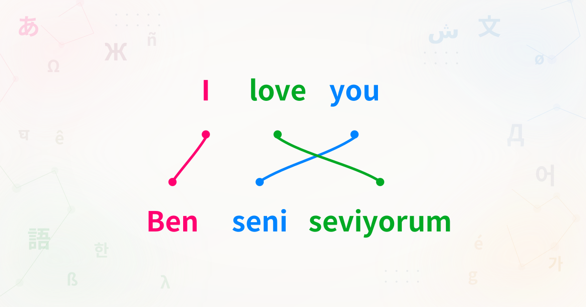

# Word Order Illustrator

> A bitext word-alignment and word-order illustrator for translators, language learners, conlangers, and linguists.

**Live demo:** <https://word-order.mkpo.li/>



Paste sentences in any languages, click matching words across rows, and the tool draws curved connectors. Reordered translations, one-to-many mappings, and many-to-one mappings all stay readable.

## Features

- **Locale-aware tokenization** via `Intl.Segmenter` — CJK, Thai, and other unspaced scripts split correctly out of the box. Use `|` for finer manual control.
- **Curved connectors** with adjustable curvature, line width, gap, straight segments, and endpoint correction.
- **Interlinear gloss** row above each sentence for Leipzig-style annotations.
- **Ruby annotations** — `<ruby>漢<rt>かん</rt></ruby>` works inside both sentence text and glosses, so furigana, pinyin, and zhuyin render correctly.
- **Per-token edit dialog** — merge selected tokens, split at any grapheme boundary, or merge into a neighbor.
- **Multiple projects via tabs** with localStorage autosave — refreshing or closing the browser preserves your work.
- **Examples gallery** — SOV vs SVO, RTL scripts, Romance pro-drop, multi-script CJK, Turkish interlinear gloss, Genesis 1:1 across Hebrew / Koine Greek / Latin / English.
- **Scramble equivalency** — instantly reorder the color groups to visualize how often translations rearrange information.
- **Export** as SVG (vector) or PNG (raster), plus full project JSON for archival and sharing.
- **UI in 20+ languages** via [Paraglide](https://inlang.com/m/gerre34r/library-inlang-paraglideJs) — including Ainu, Korean Hanja, Bulgarian, Finnish, Esperanto, Interlingua, Toki Pona, and more.
- **SEO-ready** with localized metadata, Open Graph, JSON-LD, and an Open Graph preview image.

## How to use

1. Type or paste a sentence into the input box and press **Add**. Words are split automatically using locale-aware segmentation.
2. Click a word in one row, then a matching word in an adjacent row, then press **Confirm** to connect them. Click an already-linked word to edit its color group.
3. Use the pencil icon to fine-tune tokenization (merge/split tokens) and optionally fill in an interlinear gloss row.
4. Adjust spacing, curvature, fonts, and text alignment in the Options panel.
5. Export as SVG or PNG when you're done.

For a guided tour, click the **Help** button in the header.

## Tech stack

- [SvelteKit](https://kit.svelte.dev/) (Svelte 4) + TypeScript
- [Vite](https://vitejs.dev/) (Vite 5)
- [Paraglide](https://inlang.com/m/gerre34r/library-inlang-paraglideJs) for i18n
- [`dom-to-svg`](https://github.com/felixfbecker/dom-to-svg) and [`dom-to-image`](https://github.com/tsayen/dom-to-image) for vector and raster export
- [`@neodrag/svelte`](https://www.neodrag.dev/) for draggable dialogs
- [`colorjs.io`](https://colorjs.io/) for OKLCH color palette generation
- [Iconify](https://iconify.design/) for icons
- Deployed on [Vercel](https://vercel.com/)

## Developing

[Bun](https://bun.sh) is the recommended package manager (the lockfile is `bun.lockb`) and must be installed before running the development commands.

```bash
bun install
bun dev
```

Other scripts:

```bash
bun run build               # production build (Vercel adapter)
bun run preview             # preview the production build locally
bun run check               # run paraglide compile, svelte-kit sync, and svelte-check
bun run lint                # prettier --check + eslint
bun run format              # prettier --write
bun run paraglide:compile   # regenerate i18n message modules after editing project.inlang/messages/*.json
bun run test                # Playwright E2E tests
```

### Adding a new UI language

Translations live in `project.inlang/messages/*.json`. To add a new locale:

1. Add the locale code to `project.inlang/settings.json`.
2. Copy `project.inlang/messages/en.json` to `project.inlang/messages/<locale>.json` and translate the values.
3. Run `bun run paraglide:compile` to regenerate the typed message modules.
4. Add the locale to `src/lib/lang.ts` if it needs a display name override.

Missing keys fall back to the base locale (English), so translations can be incremental.

## Contributing

Issues and pull requests welcome at <https://github.com/mkpoli/word-order/>.

## Author

Created by [@mkpoli](https://mkpo.li/) — [Twitter](https://twitter.com/mkpoli/) · [GitHub](https://github.com/mkpoli).

## A note on rights

This application doesn't claim rights over the illustrations you create with it. How you use or share them is entirely up to you. Sharing the tool itself is appreciated.
